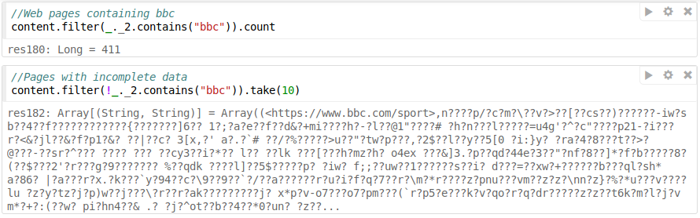
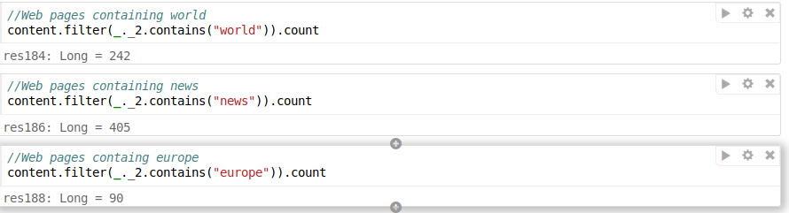
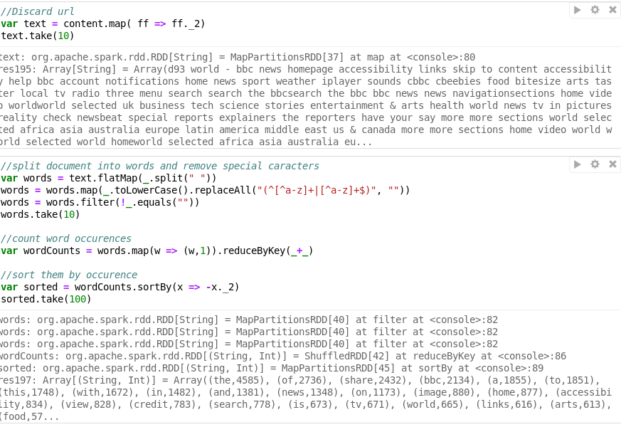
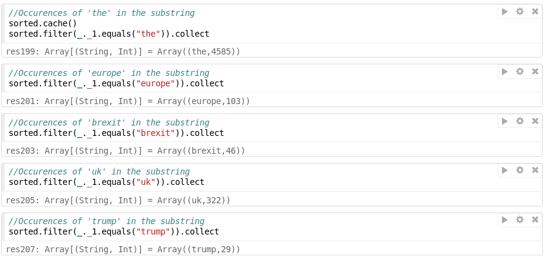

# Final Project
After learning how to do simple operations in Spark. We will now try to do these same operations but now on crawl data. This is specifically challenging as the data is unstructured and some times lacking important information. 
For this tutorial we will work with data from a crawl made over the BBC webpage. 
The data was gathered using `wget`:

```
wget -r -l 3 "https://bbc.com" --warc-file="bbc"
```

It is important to note that this is a relativly extensive crawl, which is why we only work with part of the data. For first time users as myself, I would recomment to start with a smaller webpage as this speeds up the computation noteably. 
After running the crawl, the data will be saved in the WARC format. This file includes the raw data of the run and thus provides a direct mapping of the crawl process. It contains information such as the warc-type which can be for example warcinfo, request or response. Here, we will mainly make use of responses, but it might also be interesting to look at the other types. The WARC file also contains information such as the date of the crawl, the server, the content type and most importantly the html. 

After downloading the WARC file we will perform some basic computations on the file. First, I performed all operations given in the *WARC-in-spark notebook*. I continued analysing the data, by checking for word occurences in a substring of 2000 words. 


[content](content.PNG)

As can be seen from the output there are 530 pages in total with the WARC type response. 
Below, we will count all pages that contain BBC in the text (so not in the url).



411 of the 530 pages contain the word bbc. I was also interested in which pages do not contain the word as it was a crawl over the bbc webpage (second page). Here you can see one of the disadvantages of working with real data. The content of the saved url is clearly giberish. Thus, does not contain real value. For further research it would be a good idea to get rid of data points like this one. 

Afterwards I counted some more interesting words such as **world**, **news** and **europe**.



During one of the last lectures, we learned that one of the main problems with performing webcrawls is finding similar webpages. So, I was interesting whether I made a webcrawl over the same webpage multiple times. Thus, I counted how often individual links occur. Noteable, was that the link **<https://bbc.com/weather>** occured multiple times. Thus, I first wanted to try to implement locality sensitive hashing. However, after a while I realised that this is too difficult. To still be able to compare the data points I tried to calculate the Jaccard distance between the webpages. Unfortunately, I also did not manage to work with shingles. Thus, I compared the webpages character by character. And only calculated their difference and their intersection. Noteable was that some of the webpages seemed to be quite similar with differences between 87-237 characters of 2000. Important to note is that comparing "Today I will sleep until eight" with "Today I will sleep until nine"  already has a difference of "eight" so five characters. Therefore, the pages seem to be similar. 


Next, I was interested in the occurence of some words over all documents. Thus, I run a simple word count over all pages. To do so, I first needed to remove all special characters and remove all empty words. Then, I mapped all words together with a count (one in this case) and reduced them on the value. Afterwards, I sorted the wordCounts by value to get the highest occuring words across pages.



Below you can find the counts of some interesting words. Of course, I first cached sorted in memory to reduce processing time.



Before creating my own standalone Spark application, I first run the RUBigDataApp application


 


Unfortunately, I was not able to create my own standalone application due to hours of trouble trying to get sbt work with JDK 1.7, since I usually do not use ubuntu or another linux distribution I unfortunately did not manage to change my JDK distribution. I wrote a more existensive 